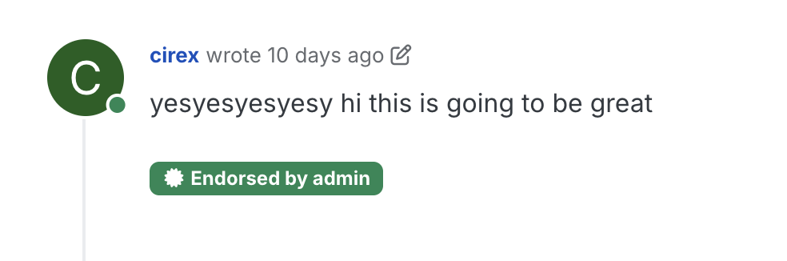
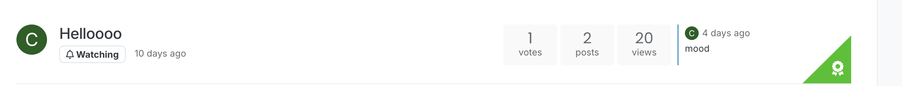
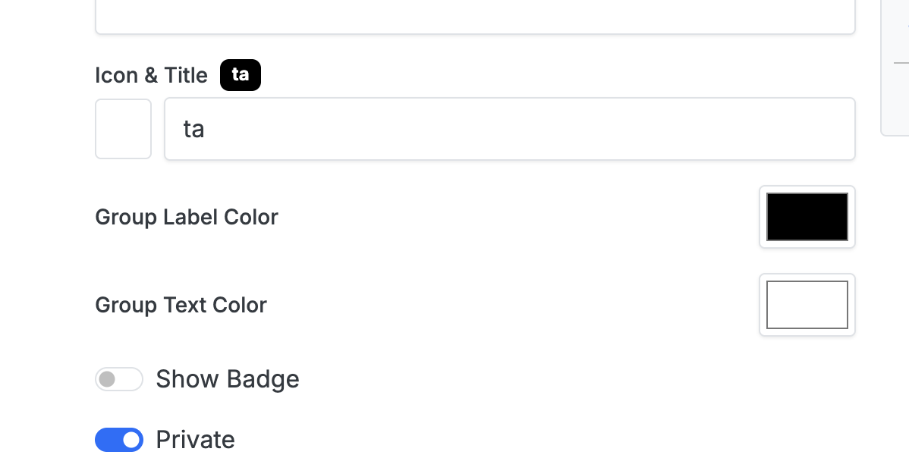
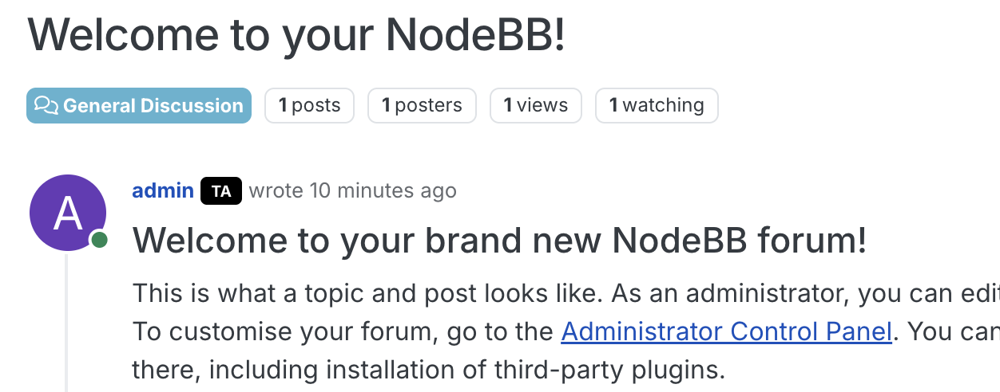
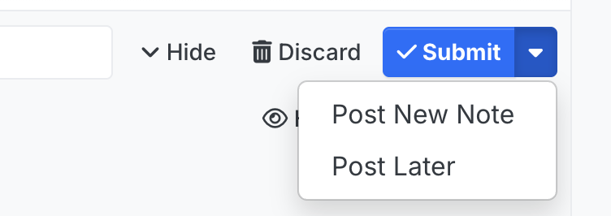
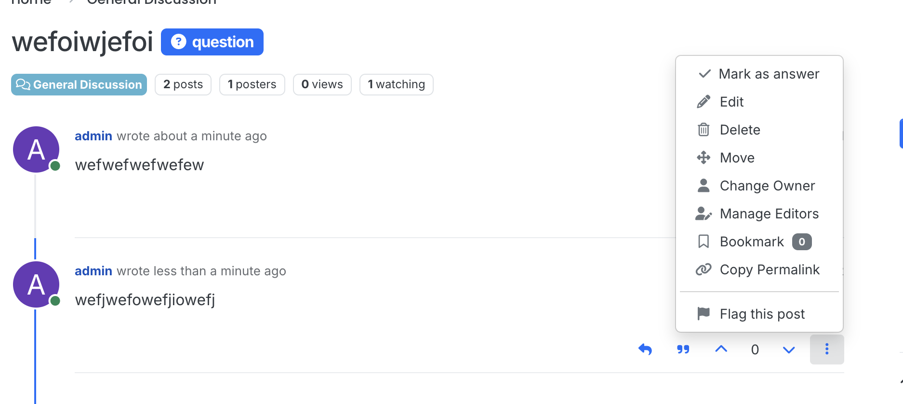
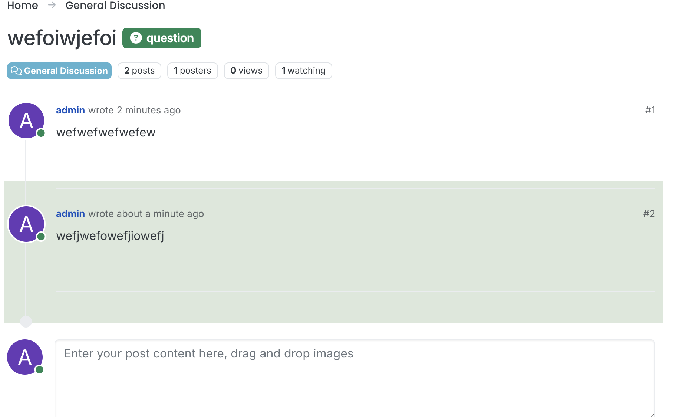

## Features

### TA/Instructor endorsement

A TA or instructor should be able to endorse posts and replies.

#### User Testing

1. Sign into the admin account
1. Make a new group called either `instructor` or `ta` (case-insensitive)
1. Upvote one of the posts
1. You should see a badge like the one below:
   
   And if you've upvoted the first post in the topic, you should also see this on the category page:

   

#### Unit testing

Two new tests have been added to `test/posts.js`

The test `voting as normal user should have post be returned as not endorsed` upvotes a post as a regular user and checks that the post has not been endorsed.

The test `voting as ta should have post be returned as endorsed` has the user join a `ta` group first before upvoting the post. We then assert that the user has been added to the `endorsedVotes` list.

This covers the backend code changes

### TA/Instructor badges

This feature forces all users in the instructor and TA groups to have a badge (either TA or INSTRUCTOR) next to their replies and posts. By default, NodeBB does offer badges, but it's opt-in per user and is by-default disabled when a user joins a group. This change makes it by-default enabled and does not allow users to hide the badge once they've joined a group. (this restriction does not apply to groups not called "ta" or "instructor")

#### User Testing

1. Create a `ta` or `instructor` group
1. Click `Edit` to edit group settings
   
1. Enable `Show Badge`. Feel free to customize the title, icon, and color of the badge.
   
1. Press Save Changes
1. You should now see the `TA` badge next to your username
   

#### Unit Testing

In `test/user.js`, I wrote the test 'should force instructor group onto groupTitleArray even if user deselects it' to test functionality. We set up the test by creating and joining the groups `ta`, `instructor`, and `other-group`. The subsequent `User.updateProfile(testUid, { groupTitle: '[]', uid: testUid })` call is akin to the user going into their settings and setting the group badge display to be false for all groups. We then verify that when getting user data, the `ta` and `instructor` groups are still present in the `groupTitleArray` field. This test covers all of the changed lines of code.

### All posts are either questions or notes

Like Piazza, students can now only post either questions or notes. (Clicking submit will create a question, while clicking Create New Note will, well, create a new note.)


to resolve a question, the original poster can open the dropdown menu on any post and click "Mark as answer". Only the original poster will see this option on the frontend.


Once a question has been resolved, a green rectangle will appear behind the answer post and the question tag will turn green. The change happens instantly, without needing a refresh, and is also persisted when the user refreshes the page.


### Unit testing

make a topic of type note
make a topic of type question (i mean it is a post technically...)

get the topic as poster
get the topic as non-poster

mark a post as answer
get the topic data again

### Anonymous Posts — Hide Author Identity (#7)

When a post is created with `anonymous: 1`, the author's identity is hidden from non-admin users across the entire platform. Admins always see the real identity.

#### What is anonymized

- **Topic view**: Anonymous posts show "Anonymous" username with a "?" avatar. Profile links are disabled.
- **Parent/quoted posts**: When replying to an anonymous post, the parent preview shows "Anonymous" instead of the real author.
- **Reply avatar previews**: The small avatar previews shown below a post (indicating who replied) show "Anonymous" for anonymous replies.
- **Category teasers**: The recent post preview on the categories page shows "Anonymous" for anonymous posts.
- **User profile pages**: Anonymous posts are excluded from `/user/:slug/posts` and the profile's latest/best posts for non-admin, non-self viewers.
- **Post count**: The post count displayed on user profiles excludes anonymous posts for non-admin, non-self viewers.

#### User Testing

Since the composer UI toggle for anonymous posting (Issue #5) is not yet implemented, anonymous posts must be created via the API:

1. Sign into the admin account
1. Open the browser console and run:
   ```js
   fetch("/api/config", { credentials: "same-origin" })
     .then((r) => r.json())
     .then(async (cfg) => {
       const res = await fetch("/api/v3/topics/1", {
         method: "POST",
         credentials: "same-origin",
         headers: {
           "Content-Type": "application/json",
           "x-csrf-token": cfg.csrf_token,
         },
         body: JSON.stringify({
           content: "This is an anonymous reply",
           anonymous: 1,
         }),
       });
       const data = await res.json();
       console.log("Created anonymous post, pid:", data.response.pid);
     });
   ```
1. View the topic — the admin should see the real identity on the anonymous post
1. Log in as a regular user (non-admin)
1. View the same topic — the anonymous post should show "Anonymous" with a "?" avatar
1. Visit the admin's profile page — the anonymous post should not appear in their post history, and the post count should not include it
1. Visit the categories page — the teaser preview should show "Anonymous" if the anonymous post is the most recent

#### Unit Testing

Seven new tests were added to `test/posts.js` inside the existing `describe('Anonymous posts', ...)` block:

- **Parent post anonymization** (2 tests): Verifies that the parent post preview shows "Anonymous" for regular users and the real username for admins.
- **Reply avatar preview anonymization** (2 tests): Verifies that reply avatar previews show the anonymous placeholder for regular users and the real avatar for admins.
- **Profile history filtering** (3 tests): Verifies that anonymous posts are excluded from other users' profile post summaries, included in the author's own profile, and included for admin viewers.
